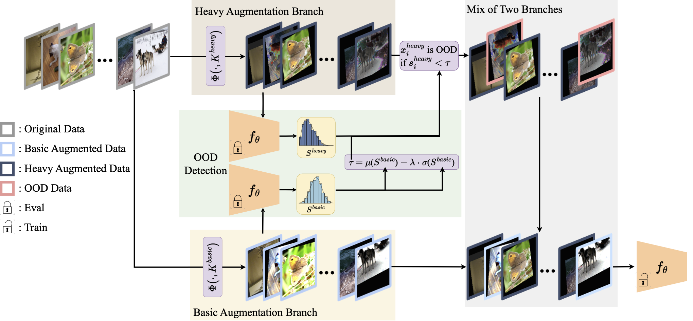

# DualAug
This is the official implementation of **DualAug: Exploiting Additional Heavy Augmentation with OOD Data Rejection** in Pytorch.

# Update
Experimental Settings for more comparative experiments are added

Simsiam's code is added

DA-Fusion's code is added

FGVC's settings are added

# Use Our Codebase
Clone this directory and ```cd``` into it.
```
git clone https://github.com/shuguang99/DualAug.git
cd DualAug
```

Install a fitting PyTorch version for your setup with GPU support, as our implementation only support setups with at least one CUDA device and install our requirements:
```
pip install -r requirements.txt
# Install a pytorch version, in many setups this has to be done manually, see pytorch.org
```

Now you should be ready to go. Start a training like so:
```
python -m Augment.train -c confs/dual_aug_wresnet28x10_cifar100_autoaug.yaml --dataroot data --tag EXPERIMENT_NAME
```
# Citation
```
@article{wang2023dualaug,
  title={DualAug: Exploiting Additional Heavy Augmentation with OOD Data Rejection},
  author={Wang, Zehao and Guo, Yiwen and Li, Qizhang and Yang, Guanglei and Zuo, Wangmeng},
  journal={arXiv preprint arXiv:2310.08139},
  year={2023}
}
```
# Acknowledge
This repository uses code from https://github.com/AIoT-MLSys-Lab/DeepAA.git
